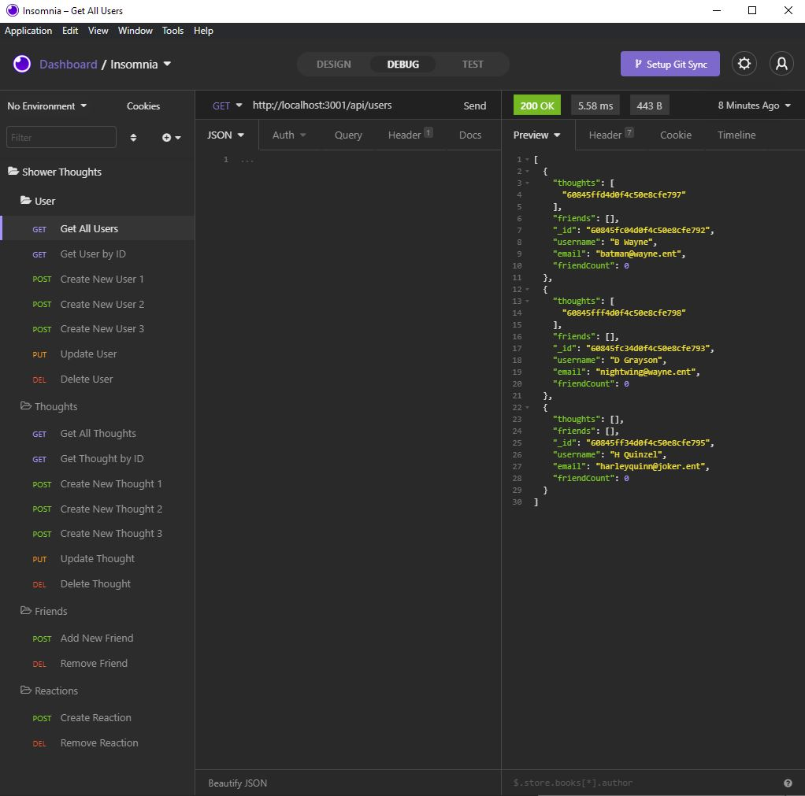

# Shower Thoughts

## Table of Contents
* [Description](#description)
* [Installation](#install)
* [The Challenge](#challenge)
* [The Criteria](#criteria)
* [Usage](#usage)

## Description 
API for a social media site for posting shower thoughts.

[Shower Thoughts API call walkthrough](https://drive.google.com/file/d/1Wi91kIHnep4DG-dawhIkM-Mqf-dWt0jo/view?usp=sharing)

## Installation 
After cloning code, using GitBash, install dependencies by typing `npm install` in the command line. Once dependencies are installed, start the server by typing `node server.js` into the command line.

## The Challenge 
AS A social media startup
I WANT an API for my social network that uses a NoSQL database
SO THAT my website can handle large amounts of unstructured data

## The Criteria 
GIVEN a social network API
1. WHEN I enter the command to invoke the application
    * THEN my server is started and the Mongoose models are synced to the MongoDB database
1. WHEN I open API GET routes in Insomnia Core for users and thoughts
    * THEN the data for each of these routes is displayed in a formatted JSON
1. WHEN I test API POST, PUT, and DELETE routes in Insomnia Core
    * THEN I am able to successfully create, update, and delete users and thoughts in my database
1. WHEN I test API POST and DELETE routes in Insomnia Core
    * THEN I am able to successfully create and delete reactions to thoughts and add and remove friends to a user’s friend list

## Usage 
ISC License

Copyright (c) 2021 Ian Jackson

Permission to use, copy, modify, and/or distribute this software for any purpose with or without fee is hereby granted, provided that the above copyright notice and this permission notice appear in all copies.

THE SOFTWARE IS PROVIDED "AS IS" AND THE AUTHOR DISCLAIMS ALL WARRANTIES WITH REGARD TO THIS SOFTWARE INCLUDING ALL IMPLIED WARRANTIES OF MERCHANTABILITY AND FITNESS. IN NO EVENT SHALL THE AUTHOR BE LIABLE FOR ANY SPECIAL, DIRECT, INDIRECT, OR CONSEQUENTIAL DAMAGES OR ANY DAMAGES WHATSOEVER RESULTING FROM LOSS OF USE, DATA OR PROFITS, WHETHER IN AN ACTION OF CONTRACT, NEGLIGENCE OR OTHER TORTIOUS ACTION, ARISING OUT OF OR IN CONNECTION WITH THE USE OR PERFORMANCE OF THIS SOFTWARE.